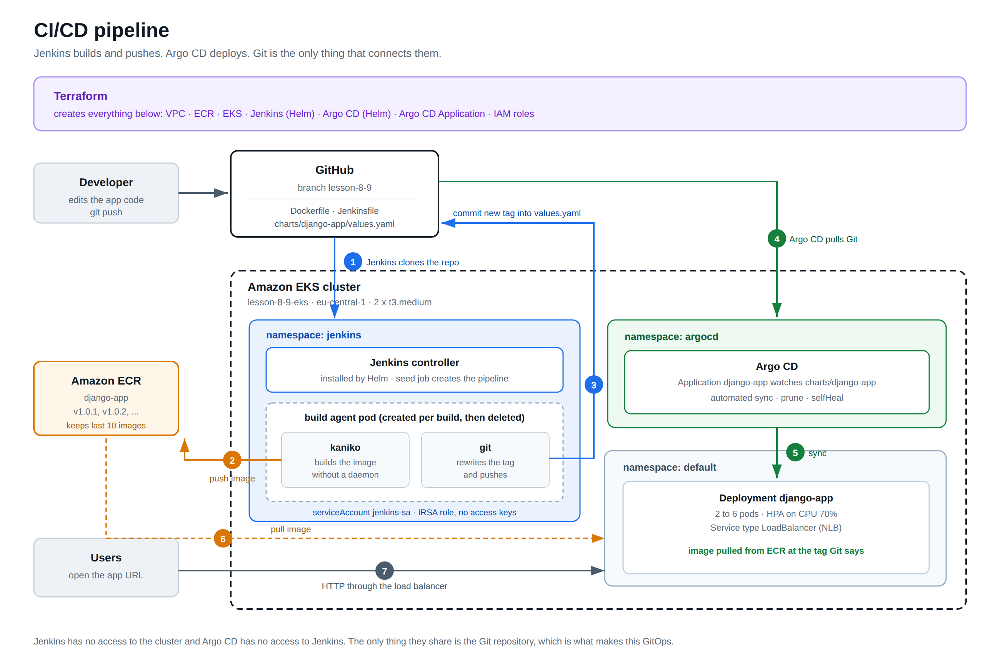

# Lesson 8-9: CI/CD with Jenkins, Terraform, ECR, Helm and Argo CD

Munteanu Bogdan

A complete deployment pipeline for a Django application. Terraform builds the
whole platform on AWS, Jenkins builds and publishes the image, and Argo CD
deploys it. Nothing in the deployment path is done by hand.



## How the pipeline works

1. I push a code change to the `lesson-8-9` branch.
2. Jenkins clones the repository into a throwaway build pod.
3. Kaniko builds the image from `Dockerfile` and pushes it to ECR as `v1.0.<build number>`.
4. The `git` container rewrites `image.tag` in `charts/django-app/values.yaml` and commits that back to the same branch.
5. Argo CD is watching that path in Git. It sees the new commit, notices the cluster no longer matches Git, and syncs.
6. Kubernetes rolls the Deployment and pulls the new image from ECR.

The important detail is step 4. Jenkins has no credentials for the cluster and
never runs `kubectl`. It only writes to Git. Argo CD never talks to Jenkins. The
repository is the only thing they share, and it is the single source of truth
for what runs in the cluster. That is what makes this GitOps rather than just
"a pipeline that deploys".

## What Terraform creates

| Module | What it builds |
|---|---|
| `modules/s3-backend` | S3 bucket and DynamoDB table for the remote state. Commented out on the first run, see below |
| `modules/vpc` | VPC 10.0.0.0/16, three public and three private subnets across three AZs, internet gateway, route tables |
| `modules/ecr` | ECR repository with scan on push and a lifecycle rule that keeps the last 10 images |
| `modules/eks` | EKS cluster, managed node group, IAM OIDC provider, EBS CSI driver and metrics-server addons |
| `modules/jenkins` | Namespace, storage class, IRSA role for ECR, Kaniko docker config, and the Jenkins Helm release configured through JCasC |
| `modules/argo_cd` | Argo CD Helm release, the repository credential secret, and the Argo CD `Application` |

## Repository layout

```
.
├── main.tf                     wires the modules together
├── backend.tf                  remote state, commented until the bucket exists
├── variables.tf                inputs
├── outputs.tf                  URLs, commands and IDs printed after apply
├── terraform.tfvars.example    copy to terraform.tfvars and fill in
│
├── modules/
│   ├── s3-backend/             s3.tf, dynamodb.tf, variables.tf, outputs.tf
│   ├── vpc/                    vpc.tf, routes.tf, variables.tf, outputs.tf
│   ├── ecr/                    ecr.tf, variables.tf, outputs.tf
│   ├── eks/                    eks.tf, node.tf, aws_ebs_csi_driver.tf,
│   │                           metrics_server.tf, variables.tf, outputs.tf
│   ├── jenkins/                jenkins.tf, values.yaml, providers.tf,
│   │                           variables.tf, outputs.tf
│   └── argo_cd/                argo_cd.tf, values.yaml, providers.tf,
│       └── charts/             variables.tf, outputs.tf
│           ├── Chart.yaml      the Argo CD Application, as a small Helm chart
│           ├── values.yaml
│           └── templates/application.yaml
│
├── charts/django-app/          the application chart Argo CD deploys
│   ├── Chart.yaml
│   ├── values.yaml             image.tag on line 10 is what Jenkins rewrites
│   └── templates/              deployment, service, configmap, hpa, _helpers
│
├── Dockerfile                  the image Kaniko builds
├── Jenkinsfile                 the pipeline
├── manage.py, config/, core/   the Django application
└── docs/cicd-pipeline.png      the diagram above
```

## Prerequisites

- Terraform 1.5 or newer
- AWS CLI v2, configured with credentials that can create IAM roles, VPCs and EKS clusters
- `kubectl` and `helm`
- A GitHub Personal Access Token with the `repo` scope

The commands below are written for a POSIX shell. On Windows PowerShell every
`kubectl ... | base64 -d` becomes:

```powershell
[Text.Encoding]::UTF8.GetString([Convert]::FromBase64String((kubectl -n jenkins get secret jenkins -o jsonpath='{.data.jenkins-admin-password}')))
```

and `echo "http://$(...)"` becomes a plain `kubectl` call, since PowerShell has
no `$(...)` command substitution in double quotes.

## 1. How to apply Terraform

### Configure the variables

```bash
cp terraform.tfvars.example terraform.tfvars
```

Then edit `terraform.tfvars`:

```hcl
github_username = "bogdanM9"
github_token    = "ghp_..."
github_repo_url = "https://github.com/bogdanM9/my-microservice-project.git"
```

`terraform.tfvars` is in `.gitignore`. Do not commit it, it holds the token.

### Apply

```bash
terraform init
terraform plan
terraform apply
```

This takes 15 to 20 minutes, almost all of it waiting for the EKS control plane
and the node group. Terraform applies in this order because of the dependency
graph: VPC and ECR first, then EKS, then the Kubernetes and Helm providers can
authenticate, then Jenkins and Argo CD.

### Point kubectl at the cluster

```bash
aws eks update-kubeconfig --region eu-central-1 --name lesson-8-9-eks
kubectl get nodes
```

Two nodes should report `Ready`.

### Put the real ECR URL into the chart

`charts/django-app/values.yaml` ships with a placeholder account id. Replace it
with the real one, which Terraform prints:

```bash
terraform output -raw ecr_repository_url
```

Paste that value into `image.repository` in `charts/django-app/values.yaml`,
commit and push. This is a one time step. From then on Jenkins maintains the
`tag` line and nobody touches the file by hand.

### Remote backend

The state bucket cannot be described by a state that lives inside itself, so it
is created in two passes.

1. Uncomment the `module "s3_backend"` block in `main.tf` and run `terraform apply`. The bucket and the lock table are created, and the state is still local.
2. Uncomment the `terraform` block in `backend.tf` and put your account id in the bucket name.
3. Run `terraform init -migrate-state`. Terraform copies the local state into S3 and answers `yes` when it asks to confirm.

From then on the state lives in S3 and DynamoDB holds the lock.

To go back to local state, comment the backend block again and run
`terraform init -migrate-state` a second time. Do this **before**
`terraform destroy`, otherwise destroy deletes the bucket that the state it is
reading lives in, and the run fails halfway through.

## 2. How to test the Jenkins job

### Open Jenkins

```bash
kubectl -n jenkins get svc jenkins
```

Wait for `EXTERNAL-IP` to stop saying `<pending>`, which takes two or three
minutes while the load balancer is provisioned. Then:

```bash
echo "http://$(kubectl -n jenkins get svc jenkins -o jsonpath='{.status.loadBalancer.ingress[0].hostname}')"
```

Log in as `admin`. The password:

```bash
kubectl -n jenkins get secret jenkins -o jsonpath='{.data.jenkins-admin-password}' | base64 -d
```

### Run the pipeline

Terraform configures Jenkins through JCasC, so there is nothing to click to set
it up. Two jobs are already there:

- **seed-job** creates the pipeline job from the repository. Run it once.
- **django-app-pipeline** is the real pipeline, created by the seed job.

So:

1. Open **seed-job** and press **Build Now**. It finishes in a few seconds.
2. Go back to the dashboard. **django-app-pipeline** now exists.
3. Open it and press **Build Now**.

The build takes three to five minutes, most of it Kaniko pushing layers. Watch
the console output. The two stages that matter:

- **Build and push image to ECR** ends with the layers pushed and the tag `v1.0.1`.
- **Update image tag in Git** prints the new `values.yaml` and pushes the commit.

### Check that it worked

The image is in ECR:

```bash
aws ecr list-images --repository-name django-app --region eu-central-1
```

The commit is in GitHub: look at the history of
`charts/django-app/values.yaml`. There should be a commit by `jenkins` saying
`ci: bump django-app image tag to v1.0.1`.

### If a build fails

| Symptom | Cause |
|---|---|
| Kaniko: `denied: User is not authorized to perform ecr:PutImage` | The pod is not using `jenkins-sa`, or the IRSA annotation is missing. Check `kubectl -n jenkins get sa jenkins-sa -o yaml`. |
| Kaniko: `no basic auth credentials` | The `kaniko-docker-config` ConfigMap is not mounted, so Kaniko does not know to use the ECR credential helper. |
| Git stage: `Authentication failed` | The PAT is wrong, expired, or missing the `repo` scope. |
| Git stage: `nothing to commit` | Not a failure. The tag is already what the build produced. The pipeline skips the commit on purpose. |
| Agent pod stuck `Pending` | The two nodes are full. Either raise `desired_size` or lower the Jenkins resource requests. |
| `jenkins-0` stuck in `Init:Error`, init log says `Multiple plugin prerequisites not met` | The Jenkins core shipped by the pinned chart is older than the plugins the init container downloads. Bump `jenkins_chart_version`. This happened on the first run with chart 5.8.27, core 2.492.2, against plugins that wanted 2.504.3. |
| `helm_release.jenkins` fails with `context deadline exceeded` | The controller never became ready inside the timeout. The real reason is in the init container: `kubectl -n jenkins logs jenkins-0 -c init`. |
| Node group fails with `InvalidParameterCombination ... not eligible for Free Tier` | The account is on the AWS Free Plan. See the note on the instance type further down. |
| seed-job fails with `script not yet approved for use` | Job DSL script security is on. The JCasC block `job-dsl-security` in `modules/jenkins/values.yaml` turns it off. |
| Pipeline fails to compile with `Invalid option type "timestamps"` | The `timestamper` plugin is missing from `installPlugins`. Every option used in the Jenkinsfile needs its plugin listed there. |

## 3. How to view the result in Argo CD

### Open Argo CD

```bash
echo "http://$(kubectl -n argocd get svc argo-cd-argocd-server -o jsonpath='{.status.loadBalancer.ingress[0].hostname}')"
```

Log in as `admin`. The password:

```bash
kubectl -n argocd get secret argocd-initial-admin-secret -o jsonpath='{.data.password}' | base64 -d
```

### What you should see

One Application, `django-app`. Click it and you get the resource tree:
Deployment, ReplicaSet, the pods, the Service, the ConfigMap and the HPA, each
with its own health icon.

Two labels matter:

- **Sync status: Synced** means the cluster matches Git.
- **Health: Healthy** means the pods are actually running and passing their probes.

Straight after a Jenkins build it will briefly say **OutOfSync**, because Git has
a new tag and the cluster is still on the old one. Automated sync is enabled, so
it fixes itself. To not wait for the poll interval, press **Refresh**, or
**Sync** to force it immediately.

### Prove it end to end

```bash
# the app URL
echo "http://$(kubectl get svc django-app-django-app -o jsonpath='{.status.loadBalancer.ingress[0].hostname}')"
```

The home page shows the image version and the pod name. Now:

1. Change something visible, for example a line in `core/templates/core/home.html`.
2. Commit and push to `lesson-8-9`.
3. Run **django-app-pipeline** in Jenkins.
4. Watch Argo CD go OutOfSync, then Synced.
5. Reload the page. The version number went up and the pod name changed.

Nobody ran `kubectl apply` anywhere in that loop.

### Useful commands

```bash
# is the tag in the cluster the same as the tag in Git?
kubectl get deploy django-app-django-app -o jsonpath='{.spec.template.spec.containers[0].image}'

# pods, service, hpa
kubectl get pods,svc,hpa

# is the HPA actually reading metrics, or does it show <unknown>?
kubectl get hpa django-app-django-app

# what did Argo CD do and when
kubectl -n argocd get applications django-app -o yaml | grep -A 10 "operationState"
```

## Design decisions worth explaining

**Kaniko instead of Docker in Docker.** Building an image inside Kubernetes with
the Docker daemon means mounting the host socket or running a privileged
container, both of which give the build a way out of its own container. Kaniko
builds the layers in userspace and needs no daemon and no privileges.

**IRSA instead of an access key.** The Kaniko pod needs to push to ECR. The
obvious way is to put an AWS access key in a Jenkins credential. Instead, the
service account carries an `eks.amazonaws.com/role-arn` annotation, EKS injects
a short lived web identity token into the pod, and the AWS SDK exchanges it for
temporary credentials. No long lived key exists anywhere, so there is nothing to
leak or rotate. The role is also scoped to this one ECR repository, apart from
`ecr:GetAuthorizationToken`, which AWS does not allow to be scoped.

**JCasC instead of clicking through the setup wizard.** The Jenkins
configuration, including the GitHub credential and the seed job, is written by
Terraform into `modules/jenkins/values.yaml`. If the Jenkins pod is deleted, it
comes back configured. Nothing about this setup depends on somebody remembering
what they clicked.

**A separate `/healthz/` endpoint.** The probes hit an endpoint that returns 200
and nothing else. Pointing a liveness probe at a page that queries a database
turns a slow query into a restart loop, and a restart loop into an outage.

**No NAT gateway.** The nodes are in public subnets. A NAT gateway costs about
$33 a month and nothing in this project runs in the private subnets, so it would
be pure waste. The private subnets exist and are tagged for internal load
balancers, so moving the node group into them later is a one line change, but a
NAT gateway has to be added at the same time or the nodes never become Ready.

## Cost

The cluster is not free. Roughly, per day:

| Item | Cost |
|---|---|
| EKS control plane | $2.40 |
| 2 x m7i-flex.large nodes | $4.30 |
| 3 load balancers (Jenkins, Argo CD, the app) | $1.30 |
| EBS volumes, ECR storage, data transfer | small change |

Around **$8 a day**, so do not leave it running.

### A note on the instance type

This account is on the AWS Free Plan. That plan refuses to launch any instance
type that is not free tier eligible, and the first apply failed on exactly that:

```
AsgInstanceLaunchFailures: Could not launch On-Demand Instances.
InvalidParameterCombination - The specified instance type is not eligible for Free Tier.
```

The types the account does allow:

```bash
aws ec2 describe-instance-types \
  --filters "Name=free-tier-eligible,Values=true" \
  --query "sort(InstanceTypes[].InstanceType)" \
  --region eu-central-1 --output table
```

which returns `t3.micro`, `t3.small`, `t4g.micro`, `t4g.small`, `c7i-flex.large`
and `m7i-flex.large`.

The micro types cannot run this project. 1 GiB of RAM is less than the Jenkins
controller alone requests, and more importantly the VPC CNI allows only **4 pods
per node** on a micro instance, against the roughly 15 that CoreDNS,
metrics-server, the EBS CSI controller, Jenkins, Argo CD and the application add
up to. No number of micro nodes fixes the RAM problem.

`m7i-flex.large` gives 8 GiB and about 29 pods per node, so two nodes are
comfortable.

## Destroy everything

```bash
# Delete the Argo CD Application first. It has a finalizer that cleans up what
# it deployed, including the app load balancer. Skipping this leaves an orphaned
# load balancer behind that Terraform does not know about and will not delete.
kubectl -n argocd delete application django-app

# Wait for the app load balancer to disappear
kubectl get svc

terraform destroy
```

If `destroy` hangs on the VPC, it is almost always a load balancer or an ENI
that Kubernetes created and Terraform does not track. Check the EC2 console
under Load Balancers and Network Interfaces, delete what is left, and run
`terraform destroy` again.

If you moved the state into S3, move it back to local **before** destroying, as
described in the remote backend section.
