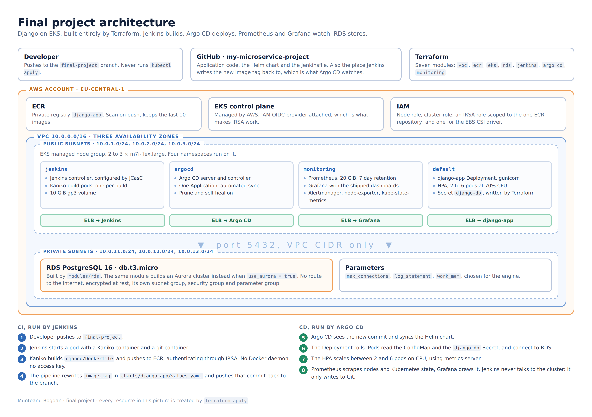

# Final project: Django on AWS with Terraform, Jenkins, Argo CD and Prometheus

Munteanu Bogdan

The whole platform is built by Terraform and the application is delivered
without anyone touching the cluster. Jenkins builds the image and writes the new
tag to Git, Argo CD reads Git and deploys, Prometheus and Grafana watch what
comes out, and the application stores its data in RDS.



| Component | Where it is built | What it does here |
|---|---|---|
| VPC | `modules/vpc` | 10.0.0.0/16, three public and three private subnets across three AZs |
| EKS | `modules/eks` | Cluster, managed node group, IAM OIDC provider, EBS CSI driver and metrics-server |
| RDS | `modules/rds` | PostgreSQL instance, or an Aurora cluster, from the same module |
| ECR | `modules/ecr` | Private registry the pipeline pushes to |
| Jenkins | `modules/jenkins` | CI, configured entirely through JCasC |
| Argo CD | `modules/argo_cd` | CD, one Application with automated sync |
| Prometheus, Grafana | `modules/monitoring` | kube-prometheus-stack in the `monitoring` namespace |

## How the delivery path works


1. I push a code change to the `final-project` branch.
2. Jenkins clones the repository into a throwaway build pod.
3. Kaniko builds the image from `django/Dockerfile` and pushes it to ECR as `v1.0.<build number>`.
4. The `git` container rewrites `image.tag` in `charts/django-app/values.yaml` and commits that back to the same branch.
5. Argo CD sees the new commit, notices the cluster no longer matches Git, and syncs.
6. Kubernetes rolls the Deployment and pulls the new image from ECR.

Step 4 is the important one. Jenkins has no credentials for the cluster and
never runs `kubectl`. It only writes to Git. Argo CD never talks to Jenkins. The
repository is the only thing they share, and it is the single source of truth
for what runs in the cluster. That is what makes this GitOps rather than just a
pipeline that deploys.

## Repository layout

```
.
├── main.tf                     wires the modules together
├── backend.tf                  remote state, commented until the bucket exists
├── variables.tf                inputs
├── outputs.tf                  URLs, commands and IDs printed after apply
├── terraform.tfvars.example    copy to terraform.tfvars and fill in
│
├── modules/
│   ├── s3-backend/             s3.tf, dynamodb.tf, variables.tf, outputs.tf
│   ├── vpc/                    vpc.tf, routes.tf, variables.tf, outputs.tf
│   ├── ecr/                    ecr.tf, variables.tf, outputs.tf
│   ├── eks/                    eks.tf, node.tf, aws_ebs_csi_driver.tf,
│   │                           metrics_server.tf, variables.tf, outputs.tf
│   ├── rds/                    shared.tf, rds.tf, aurora.tf, variables.tf,
│   │                           outputs.tf, README.md
│   ├── jenkins/                jenkins.tf, values.yaml, providers.tf,
│   │                           variables.tf, outputs.tf
│   ├── monitoring/             prometheus.tf, values.yaml, providers.tf,
│   │                           variables.tf, outputs.tf, README.md
│   └── argo_cd/                argo_cd.tf, values.yaml, providers.tf,
│       └── charts/             variables.tf, outputs.tf
│           ├── Chart.yaml      the Argo CD Application, as a small Helm chart
│           ├── values.yaml
│           └── templates/application.yaml
│
├── charts/django-app/          the application chart Argo CD deploys
│   ├── Chart.yaml
│   ├── values.yaml             image.tag is the line Jenkins rewrites
│   └── templates/              deployment, service, configmap, hpa, _helpers
│
├── django/                     the application
│   ├── Dockerfile              the image Kaniko builds
│   ├── Jenkinsfile             the pipeline
│   ├── docker-compose.yaml     the same app plus a Postgres, for local work
│   ├── manage.py, requirements.txt
│   ├── config/                 settings, urls, wsgi
│   └── core/                   views, template, static file
│
└── docs/
    ├── architecture.png        the diagram at the top
    ├── cicd-pipeline.png       the delivery path on its own
    └── troubleshooting.md      errors that actually happened, and their causes
```

Two modules document themselves, because their detail belongs next to the code
rather than here:

- [`modules/rds/README.md`](modules/rds/README.md), the universal database module: usage, every variable, and how to switch between Aurora and a standard instance
- [`modules/monitoring/README.md`](modules/monitoring/README.md), the monitoring stack: what each component gives, and what to look at in Grafana

## Prerequisites

- Terraform 1.5 or newer
- AWS CLI v2, with credentials that can create IAM roles, VPCs and EKS clusters
- `kubectl` and `helm`
- A GitHub Personal Access Token with the `repo` scope

The commands below are written for a POSIX shell. On Windows PowerShell,
`kubectl ... | base64 -d` becomes:

```powershell
[Text.Encoding]::UTF8.GetString([Convert]::FromBase64String((kubectl -n jenkins get secret jenkins -o jsonpath='{.data.jenkins-admin-password}')))
```

## The four stages

| Stage | What to run | Section |
|---|---|---|
| 1. Environment preparation | `terraform init`, check `terraform.tfvars` | 1 |
| 2. Infrastructure deployment | `terraform apply`, then `kubectl get all` in the three namespaces | 1 |
| 3. Availability check | Jenkins and Argo CD | 2 and 3 |
| 4. Monitoring and metrics | Grafana, and the HPA under load | 4 |

## 1. Apply Terraform

```bash
cp terraform.tfvars.example terraform.tfvars
```

Then fill in the three values that have no default:

```hcl
github_username = "bogdanM9"
github_token    = "ghp_..."
github_repo_url = "https://github.com/bogdanM9/my-microservice-project.git"
```

`terraform.tfvars` is in `.gitignore`. Do not commit it, it holds the token.

```bash
terraform init
terraform plan
terraform apply
```

This takes 20 to 25 minutes, almost all of it waiting for the EKS control plane
and the node group. Terraform works out the order from the dependency graph: VPC
and ECR first, then EKS, then the Kubernetes and Helm providers can
authenticate, then RDS, Jenkins, Argo CD and the monitoring stack.

Then point `kubectl` at the cluster and check the three namespaces the brief
asks about:

```bash
aws eks update-kubeconfig --region eu-central-1 --name lesson-8-9-eks

kubectl get nodes
kubectl get all -n jenkins
kubectl get all -n argocd
kubectl get all -n monitoring
```

One step is manual and happens once. `charts/django-app/values.yaml` ships with
a placeholder account id in `image.repository`. Replace it with the real one:

```bash
terraform output -raw ecr_repository_url
```

Commit and push that. From then on Jenkins maintains the `tag` line and nobody
edits the file by hand.

### Remote backend

The state bucket cannot be described by a state that lives inside itself, so it
is created in two passes.

1. Uncomment `module "s3_backend"` in `main.tf` and run `terraform apply`. The bucket and the lock table are created, and the state is still local.
2. Uncomment the `terraform` block in `backend.tf` and put your account id in the bucket name.
3. Run `terraform init -migrate-state` and confirm.

To go back to local state, comment the backend block again and run
`terraform init -migrate-state` a second time. Do this **before**
`terraform destroy`, otherwise destroy deletes the bucket holding the state it
is reading from and fails halfway through.

## 2. Test the Jenkins job

```bash
kubectl -n jenkins get svc jenkins
```

Wait for `EXTERNAL-IP`, then open it. User `admin`, password:

```bash
kubectl -n jenkins get secret jenkins -o jsonpath='{.data.jenkins-admin-password}' | base64 -d
```

Terraform configures Jenkins through JCasC, so there is nothing to set up by
hand. Two jobs are already there:

- **seed-job** creates the pipeline job from the repository. Run it once.
- **django-app-pipeline** is the real pipeline, created by the seed job.

Press **Build Now** on `seed-job`, go back to the dashboard, then press
**Build Now** on `django-app-pipeline`. The build takes three to five minutes,
most of it Kaniko pushing layers. The two stages that matter are **Build and
push image to ECR** and **Update image tag in Git**.

Check it landed:

```bash
aws ecr list-images --repository-name django-app --region eu-central-1
```

and look at the history of `charts/django-app/values.yaml` on GitHub. There
should be a commit by `jenkins` saying `ci: bump django-app image tag to v1.0.x`.

When a build fails, [`docs/troubleshooting.md`](docs/troubleshooting.md) lists
the errors that actually came up here and what caused each one.

## 3. View the result in Argo CD

```bash
kubectl -n argocd get svc argo-cd-argocd-server
kubectl -n argocd get secret argocd-initial-admin-secret -o jsonpath='{.data.password}' | base64 -d
```

Log in as `admin`. There is one Application, `django-app`. Open it and the
resource tree appears: Deployment, ReplicaSet, pods, Service, ConfigMap and HPA,
each with its own health icon.

Two labels matter. **Synced** means the cluster matches Git. **Healthy** means
the pods are running and passing their probes. Straight after a Jenkins build it
briefly says **OutOfSync**, because Git has a new tag and the cluster is still on
the old one. Automated sync fixes it within about three minutes, or immediately
if you press **Refresh**.

The **Last Sync** panel is the proof the loop is closed: the author is `jenkins`
and the message is the tag bump commit, not anything a person typed.

### Prove it end to end

```bash
echo "http://$(kubectl get svc django-app-django-app -o jsonpath='{.status.loadBalancer.ingress[0].hostname}')"
```

The home page shows the image version, the pod name and the database status.
Change a line in `django/core/templates/core/home.html`, push, run the pipeline,
and watch Argo CD go OutOfSync and back. The version number goes up and the pod
name changes. Nobody ran `kubectl apply` anywhere in that loop.

## 4. Monitoring and metrics

`modules/monitoring` installs kube-prometheus-stack: Prometheus with a 20 GiB
volume and 7 days of retention, Grafana with the dashboards the chart ships,
Alertmanager, node-exporter on every node, and kube-state-metrics.

```bash
kubectl -n monitoring get svc kube-prometheus-stack-grafana
terraform output -raw grafana_admin_password
```

Or, as the brief puts it, without going through the load balancer:

```bash
kubectl port-forward svc/kube-prometheus-stack-grafana 3000:80 -n monitoring
```

In Grafana, **Dashboards**, then *Kubernetes / Compute Resources / Cluster* for
the whole cluster and *Namespace (Workloads)* with namespace `default` for the
application. *Node Exporter / Nodes* covers the machines themselves.

The autoscaling shows up there too, because kube-state-metrics exports the HPA
numbers. Put some load on the application and watch:

```bash
kubectl get hpa -w
```

Details, including the Prometheus queries and why four cluster components are
turned off, are in [`modules/monitoring/README.md`](modules/monitoring/README.md).

## 5. How the application reaches the database

Nothing about the database is committed. The chain is:

1. `modules/rds` builds the instance and generates the master password.
2. The root `main.tf` writes a Kubernetes Secret named `django-db` in the application namespace, filled from the module outputs.
3. `charts/django-app/values.yaml` names that Secret, and the Deployment reads it with `envFrom`.
4. `django/config/settings.py` reads `POSTGRES_HOST` and the rest, and falls back to a local SQLite file when they are missing, so the image still runs outside the cluster.

The Helm chart therefore never contains a host name or a password, and neither
does the repository. Terraform is the only thing that knows both halves.

To check it from outside:

```bash
curl "http://$(kubectl get svc django-app-django-app -o jsonpath='{.status.loadBalancer.ingress[0].hostname}')/dbz/"
```

```json
{"engine": "postgresql", "host": "lesson-8-9-db...rds.amazonaws.com", "ok": true, "detail": "connected"}
```

It returns 503 instead of 200 when the query fails. The probes deliberately do
not use it: a probe that touches the database turns a slow query into a restart
loop.

## Design decisions worth explaining

**Kaniko instead of Docker in Docker.** Building an image inside Kubernetes with
the Docker daemon means mounting the host socket or running a privileged
container, both of which give the build a way out of its own container. Kaniko
builds the layers in userspace, with no daemon and no privileges.

**IRSA instead of an access key.** The Kaniko pod needs to push to ECR. The
obvious way is to put an AWS access key in a Jenkins credential. Instead the
service account carries an `eks.amazonaws.com/role-arn` annotation, EKS injects a
short lived token into the pod, and the SDK exchanges it for temporary
credentials. No long lived key exists anywhere, so there is nothing to leak or
rotate. The role is scoped to this one ECR repository.

**JCasC instead of clicking through the setup wizard.** The Jenkins
configuration, including the GitHub credential and the seed job, is written by
Terraform. If the Jenkins pod is deleted it comes back configured. Nothing here
depends on somebody remembering what they clicked.

**The database is not reachable from the internet.** It sits in the private
subnets, its security group allows port 5432 from the VPC CIDR and nothing else,
and it is encrypted at rest. The password is generated by Terraform and handed to
the pods through a Secret, so it exists in the state file and in the cluster, and
nowhere else.

**A separate `/healthz/` endpoint.** The probes hit an endpoint that returns 200
and nothing else, while `/dbz/` is where the database check lives. Pointing a
liveness probe at a page that queries a database turns a slow query into a
restart loop, and a restart loop into an outage.

**No NAT gateway.** The nodes are in public subnets. A NAT gateway costs about
$33 a month, and the only thing in the private subnets is RDS, which has no
reason to reach the internet. Moving the node group into the private subnets
later is a one line change, but a NAT gateway has to be added at the same time or
the nodes never become Ready.

**The gp3 storage class is created by the Jenkins module.** It is cluster wide
and on paper belongs to the EKS module. It cannot live there: the Kubernetes
provider is configured from the EKS cluster data source, so a Kubernetes resource
inside that module would need the provider before the module it depends on has
finished, which is a dependency cycle. It sits in the first module that needed a
volume, and the monitoring module takes the name from that module's output rather
than hardcoding the string, so Terraform still knows the order.

## Cost

Roughly, per day:

| Item | Cost |
|---|---|
| EKS control plane | $2.40 |
| 2 x m7i-flex.large nodes | $4.30 |
| 4 load balancers: Jenkins, Argo CD, Grafana, the app | $1.75 |
| EBS volumes, ECR storage, data transfer | small change |
| RDS db.t3.micro, single AZ | free tier for the first 750 hours a month |

Around **$9 a day**, so do not leave it running.

### A note on the instance type

This account is on the AWS Free Plan, which refuses to launch any instance type
that is not free tier eligible. The first apply failed with
`InvalidParameterCombination - The specified instance type is not eligible for
Free Tier`. The eligible list comes from:

```bash
aws ec2 describe-instance-types --filters "Name=free-tier-eligible,Values=true" \
  --query "InstanceTypes[].InstanceType" --region eu-central-1
```

`t3.micro` and the other micro sizes are unusable here: 1 GiB of RAM is less than
Jenkins alone requests, and the VPC CNI allows only 4 pods per node on them
against the roughly 20 this project needs. `m7i-flex.large` gives 8 GiB and about
29 pods per node.

### A note on the names

`git_branch` defaults to `final-project`, so Jenkins builds from this branch and
Argo CD watches it.

`project_name` and `cluster_name` still say `lesson-8-9`. The cluster, the VPC
and the ECR repository were built during that task, and renaming them would tear
the entire environment down and build it again for nothing but a nicer string.

## Destroy everything

```bash
# Delete the Argo CD Application first. It has a finalizer that cleans up what
# it deployed, including the app load balancer. Skipping this leaves an orphaned
# load balancer that Terraform does not know about and will not delete.
kubectl -n argocd delete application django-app

# Wait for the app load balancer to disappear
kubectl get svc

terraform destroy
```

`terraform destroy` takes care of the other three load balancers, because those
services belong to Helm releases Terraform owns. The RDS instance is deleted with
`skip_final_snapshot = true`, so nothing is kept. Set that variable to `false`
first if the data matters.

If `destroy` hangs on the VPC, it is almost always a load balancer or an ENI that
Kubernetes created and Terraform does not track. Check the EC2 console under Load
Balancers and Network Interfaces, delete what is left, and run `terraform
destroy` again.
