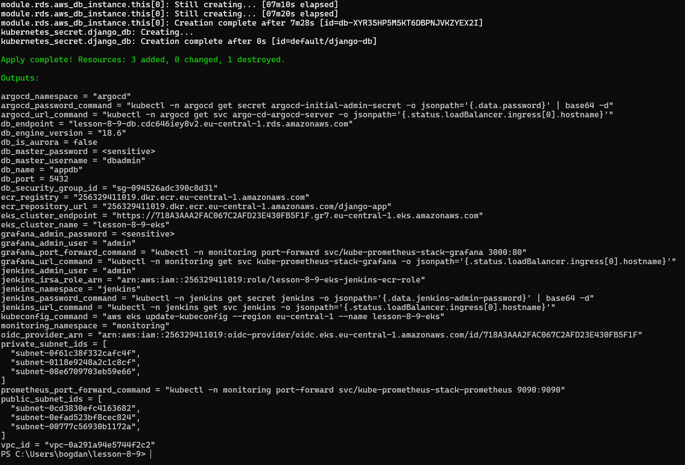
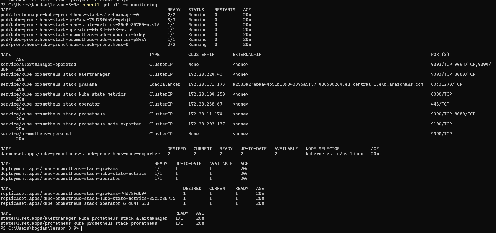
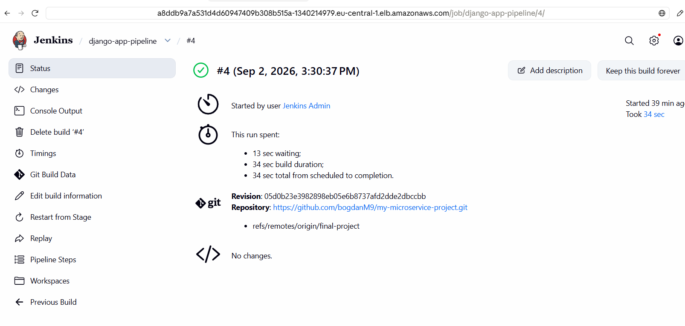
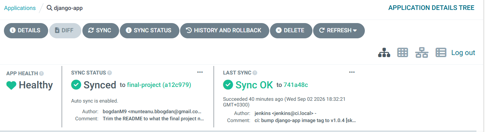
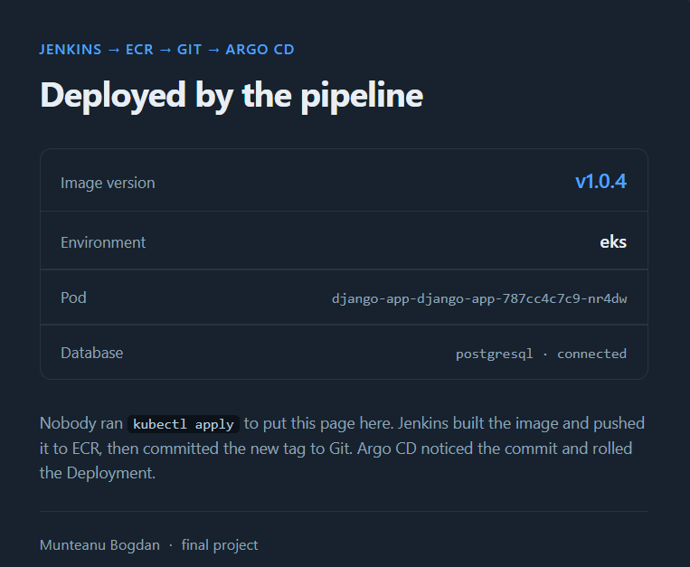
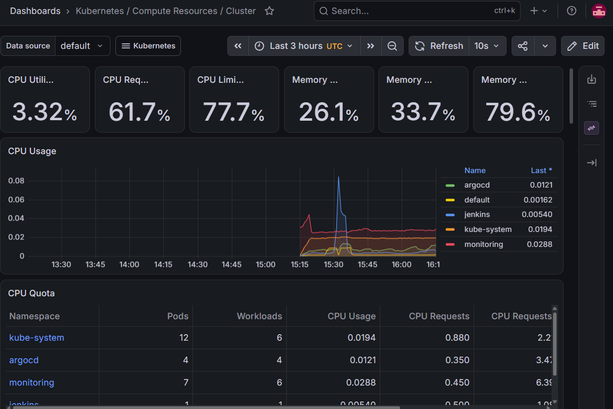
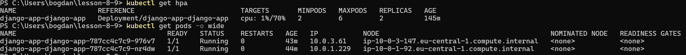

# Final project: Django on AWS with Terraform, Jenkins, Argo CD and Prometheus

Munteanu Bogdan

The whole platform is built by Terraform and the application is delivered
without anyone touching the cluster. Jenkins builds the image and writes the new
tag to Git, Argo CD reads Git and deploys, Prometheus and Grafana watch what
comes out, and the application stores its data in RDS.


| Component | Where it is built | What it does here |
|---|---|---|
| VPC | `modules/vpc` | 10.0.0.0/16, three public and three private subnets across three AZs |
| EKS | `modules/eks` | Cluster, managed node group, IAM OIDC provider, EBS CSI driver and metrics-server |
| RDS | `modules/rds` | PostgreSQL instance, or an Aurora cluster, from the same module |
| ECR | `modules/ecr` | Private registry the pipeline pushes to |
| Jenkins | `modules/jenkins` | CI, configured entirely through JCasC |
| Argo CD | `modules/argo_cd` | CD, one Application with automated sync |
| Prometheus, Grafana | `modules/monitoring` | kube-prometheus-stack in the `monitoring` namespace |

## How the delivery path works


1. I push a code change to the `final-project` branch.
2. Jenkins clones the repository into a throwaway build pod.
3. Kaniko builds the image from `django/Dockerfile` and pushes it to ECR as `v1.0.<build number>`.
4. The `git` container rewrites `image.tag` in `charts/django-app/values.yaml` and commits that back to the same branch.
5. Argo CD sees the new commit, notices the cluster no longer matches Git, and syncs.
6. Kubernetes rolls the Deployment and pulls the new image from ECR.

Step 4 is the important one. Jenkins has no credentials for the cluster and
never runs `kubectl`. It only writes to Git. Argo CD never talks to Jenkins. The
repository is the only thing they share, and it is the single source of truth for
what runs in the cluster. That is what makes this GitOps rather than just a
pipeline that deploys.

## Repository layout

```
.
├── main.tf, variables.tf, outputs.tf   wires the modules together
├── backend.tf                          remote state, commented until the bucket exists
├── terraform.tfvars.example            copy to terraform.tfvars and fill in
│
├── modules/       s3-backend, vpc, ecr, eks, rds, jenkins, argo_cd, monitoring
│                  each with its own variables.tf and outputs.tf
│
├── charts/django-app/   the chart Argo CD deploys. image.tag is the line Jenkins
│                        rewrites. templates: deployment, service, configmap, hpa
│
├── django/        the application: Dockerfile, Jenkinsfile, docker-compose.yaml,
│                  manage.py, requirements.txt, config/, core/
│
└── docs/          architecture.png, cicd-pipeline.png, screenshots/
```

## Prerequisites

- Terraform 1.5 or newer
- AWS CLI v2, with credentials that can create IAM roles, VPCs and EKS clusters
- `kubectl` and `helm`
- A GitHub Personal Access Token with the `repo` scope

The commands below are written for a POSIX shell. On Windows PowerShell,
`kubectl ... | base64 -d` becomes:

```powershell
[Text.Encoding]::UTF8.GetString([Convert]::FromBase64String((kubectl -n jenkins get secret jenkins -o jsonpath='{.data.jenkins-admin-password}')))
```

## The four stages

| Stage | What to run | Section |
|---|---|---|
| 1. Environment preparation | `terraform init`, check `terraform.tfvars` | 1 |
| 2. Infrastructure deployment | `terraform apply`, then `kubectl get all` in the three namespaces | 1 |
| 3. Availability check | Jenkins and Argo CD | 2 and 3 |
| 4. Monitoring and metrics | Grafana, and the HPA under load | 4 |

## 1. Apply Terraform

Copy `terraform.tfvars.example` to `terraform.tfvars` and fill in the three
values that have no default: `github_username`, `github_token` and
`github_repo_url`. That file is in `.gitignore`, it holds the token.

```bash
terraform init
terraform plan
terraform apply
```

This takes 20 to 25 minutes, almost all of it waiting for the EKS control plane
and the node group. Terraform works the order out from the dependency graph: VPC
and ECR first, then EKS, then the Kubernetes and Helm providers can
authenticate, then RDS, Jenkins, Argo CD and the monitoring stack.

Then point `kubectl` at the cluster and check the three namespaces:

```bash
aws eks update-kubeconfig --region eu-central-1 --name lesson-8-9-eks

kubectl get nodes
kubectl get all -n jenkins
kubectl get all -n argocd
kubectl get all -n monitoring
```

One step is manual and happens once: `charts/django-app/values.yaml` ships with a
placeholder account id in `image.repository`, so replace it with what
`terraform output -raw ecr_repository_url` prints, then commit and push. From
then on Jenkins maintains the `tag` line.

### Remote backend

The state bucket cannot be described by a state living inside itself, so it takes
two passes: uncomment `module "s3_backend"` in `main.tf` and apply, then
uncomment the block in `backend.tf` and run `terraform init -migrate-state`.
Migrate back to local **before** `terraform destroy`, otherwise destroy deletes
the bucket holding the state it is reading from.

## 2. Test the Jenkins job

```bash
kubectl -n jenkins get svc jenkins
kubectl -n jenkins get secret jenkins -o jsonpath='{.data.jenkins-admin-password}' | base64 -d
```

Wait for `EXTERNAL-IP`, open it, log in as `admin`.

Terraform configures Jenkins through JCasC, so there is nothing to set up by
hand. Two jobs are already there: **seed-job**, which creates the pipeline job
from the repository and is run once, and **django-app-pipeline**, the real
pipeline that the seed job creates.

Press **Build Now** on `seed-job`, go back to the dashboard, then press
**Build Now** on `django-app-pipeline`. The build takes three to five minutes,
most of it Kaniko pushing layers. The two stages that matter are **Build and
push image to ECR** and **Update image tag in Git**.

Check it landed with `aws ecr list-images --repository-name django-app --region
eu-central-1`, and look at the history of `charts/django-app/values.yaml` on
GitHub: there should be a commit by `jenkins` saying `ci: bump django-app image
tag to v1.0.x`.

## 3. View the result in Argo CD

```bash
kubectl -n argocd get svc argo-cd-argocd-server
kubectl -n argocd get secret argocd-initial-admin-secret -o jsonpath='{.data.password}' | base64 -d
```

Log in as `admin`. There is one Application, `django-app`. Open it and the
resource tree appears: Deployment, ReplicaSet, pods, Service, ConfigMap and HPA,
each with its own health icon.

Two labels matter. **Synced** means the cluster matches Git, **Healthy** means
the pods are running and passing their probes. Straight after a Jenkins build it
briefly says **OutOfSync**, because Git has a new tag and the cluster is still on
the old one. Automated sync fixes it within about three minutes, or immediately
if you press **Refresh**.

The **Last Sync** panel is the proof the loop is closed: the author is `jenkins`
and the message is the tag bump commit, not anything a person typed.

### Prove it end to end

```bash
echo "http://$(kubectl get svc django-app-django-app -o jsonpath='{.status.loadBalancer.ingress[0].hostname}')"
```

The home page shows the image version, the pod name and the database status.
Change a line in `django/core/templates/core/home.html`, push, run the pipeline,
and watch Argo CD go OutOfSync and back: the version goes up and the pod name
changes, with nobody running `kubectl apply` anywhere in that loop.

## 4. Monitoring and metrics

`modules/monitoring` installs kube-prometheus-stack, one chart that brings the
operator, Prometheus with a 20 GiB volume and 7 days of retention, Grafana with
the dashboards it ships, Alertmanager, node-exporter on every node and
kube-state-metrics. Installing them separately would mean wiring the scrape
configuration and the Grafana data source by hand.

```bash
kubectl -n monitoring get svc kube-prometheus-stack-grafana
terraform output -raw grafana_admin_password
```

Or, without going through the load balancer:

```bash
kubectl port-forward svc/kube-prometheus-stack-grafana 3000:80 -n monitoring
kubectl -n monitoring port-forward svc/kube-prometheus-stack-prometheus 9090:9090
```

In Grafana, **Dashboards**, then *Kubernetes / Compute Resources / Cluster*,
*Namespace (Workloads)* with namespace `default` for the application, and
*Node Exporter / Nodes* for the machines. The autoscaling shows up there too,
because kube-state-metrics exports the HPA numbers. Put load on the application
and watch `kubectl get hpa -w`, or query Prometheus directly:

```promql
kube_horizontalpodautoscaler_status_current_replicas{horizontalpodautoscaler="django-app-django-app"}
```

Two settings in `modules/monitoring/values.yaml` matter.
`serviceMonitorSelectorNilUsesHelmValues: false` makes the operator watch every
ServiceMonitor in the cluster, not only the ones carrying its own release label.
And the four control plane components are turned off, because EKS does not expose
them and leaving them on gives four targets that sit red forever.

## 5. How the application reaches the database

Nothing about the database is committed. `modules/rds` builds the instance and
generates the master password, the root `main.tf` writes a Kubernetes Secret named
`django-db` from the module outputs, `charts/django-app/values.yaml` names that
Secret and the Deployment reads it with `envFrom`, and
`django/config/settings.py` reads `POSTGRES_HOST` and the rest, falling back to a
local SQLite file when they are missing so the image still runs outside the
cluster.

The chart therefore never contains a host name or a password, and neither does
the repository. Terraform is the only thing that knows both halves.

```bash
curl "http://$(kubectl get svc django-app-django-app -o jsonpath='{.status.loadBalancer.ingress[0].hostname}')/dbz/"
{"engine": "postgresql", "host": "lesson-8-9-db...rds.amazonaws.com", "ok": true, "detail": "connected"}
```

It returns 503 instead of 200 when the query fails. The probes deliberately do
not use it: a probe that touches the database turns a slow query into a restart
loop.

### The rds module is universal

The same module builds either shape, decided by one flag. `use_aurora = false`
builds an `aws_db_instance`, `true` builds an `aws_rds_cluster` with a writer and
however many readers were asked for. Either way it also builds the DB subnet
group, the security group with its rules, and a parameter group carrying
`max_connections`, `log_statement` and `work_mem`. Terraform has no `if`, so the
switch is `count = var.use_aurora ? 1 : 0` and the branch not taken disappears
from the plan.

The version and the parameter group family are not written by hand. An
`aws_rds_engine_version` data source resolves both from the RDS API, which is not
gold plating: the first apply failed with `Cannot find version 16.6 for
postgres`, because AWS had withdrawn that release from the region.

Switching the whole database, including to MySQL or to Aurora, is a change in
`terraform.tfvars` only. The variables are documented in
`modules/rds/variables.tf`, all typed and described, five of them validated.

## Proof that it ran

The environment is torn down after review, so these are the runs as they
happened, in order.

**1. `terraform apply`.** The whole platform from one command.



**2. The monitoring namespace.** Prometheus, Grafana, Alertmanager, the operator,
kube-state-metrics and node-exporter on both nodes.



**3. The Jenkins pipeline.** Build 4, green, from the `final-project` branch.



**4. Argo CD.** Synced and Healthy, and the Last Sync panel names the author as
`jenkins <jenkins@ci.local>` with the message `ci: bump django-app image tag to
v1.0.4`. That is the whole point of the setup in one screenshot: the deployment
came from a commit Jenkins wrote, not from anybody running `kubectl`.



**5. The application.** Version `v1.0.4`, the pod name, and the database line
proving the pod reaches RDS through the Secret Terraform wrote.



**6. Grafana.** Live cluster metrics, broken down per namespace.



**7. Autoscaling.** The HPA reading real CPU, between 2 and 6 replicas, and the
two pods sitting on different nodes.



## Design decisions worth explaining

**Kaniko instead of Docker in Docker.** Building an image inside Kubernetes with
the Docker daemon means mounting the host socket or running a privileged
container, both of which give the build a way out of its own container. Kaniko
builds the layers in userspace, with no daemon and no privileges.

**IRSA instead of an access key.** The obvious way to let Kaniko push to ECR is
an AWS access key in a Jenkins credential. Instead the service account carries an
`eks.amazonaws.com/role-arn` annotation, EKS injects a short lived token, and the
SDK exchanges it for temporary credentials. Nothing long lived exists to leak or
rotate, and the role is scoped to this one repository.

**JCasC instead of the setup wizard.** The Jenkins configuration, including the
GitHub credential and the seed job, is written by Terraform, so a deleted pod
comes back configured and nothing depends on remembering what was clicked.

**The database is not reachable from the internet.** It sits in the private
subnets, its security group allows port 5432 from the VPC CIDR and nothing else,
and it is encrypted at rest. The password is generated by Terraform and reaches
the pods through a Secret, so it exists in the state file and in the cluster and
nowhere else.

**A separate `/healthz/` endpoint.** The probes hit an endpoint that returns 200
and nothing else, while `/dbz/` is where the database check lives. Pointing a
liveness probe at a page that queries a database turns a slow query into a
restart loop, and a restart loop into an outage.

**No NAT gateway.** The nodes are in public subnets. A NAT gateway costs about
$33 a month, and the only thing in the private subnets is RDS, which has no reason
to reach the internet.

## Cost

Roughly, per day: $2.40 for the EKS control plane, $4.30 for two
`m7i-flex.large` nodes, $1.75 for the four load balancers, and small change for
the volumes and ECR storage. The `db.t3.micro` RDS instance is free tier for the
first 750 hours a month. Around **$9 a day**, so do not leave it running.

### Two notes

The account is on the AWS Free Plan, which refuses instance types that are not
free tier eligible, and the first apply failed on exactly that. The eligible
micro sizes are unusable here: 1 GiB is less than Jenkins alone requests, and the
VPC CNI allows 4 pods per node on them against the roughly 20 needed.

`project_name` and `cluster_name` still say `lesson-8-9`, because renaming them
would rebuild the whole environment for nothing but a nicer string.

## Destroy everything

```bash
# Delete the Argo CD Application first. It has a finalizer that cleans up what
# it deployed, including the app load balancer. Skipping this leaves an orphaned
# load balancer that Terraform does not know about and will not delete.
kubectl -n argocd delete application django-app

# Wait for the app load balancer to disappear
kubectl get svc

terraform destroy
```

`terraform destroy` takes care of the other three load balancers, because those
services belong to Helm releases Terraform owns. The RDS instance is deleted with
`skip_final_snapshot = true`, so nothing is kept. Set that variable to `false`
first if the data matters.

If `destroy` hangs on the VPC, it is almost always a load balancer or an ENI that
Kubernetes created and Terraform does not track. Check the EC2 console under Load
Balancers and Network Interfaces, delete what is left, and run `terraform
destroy` again.
